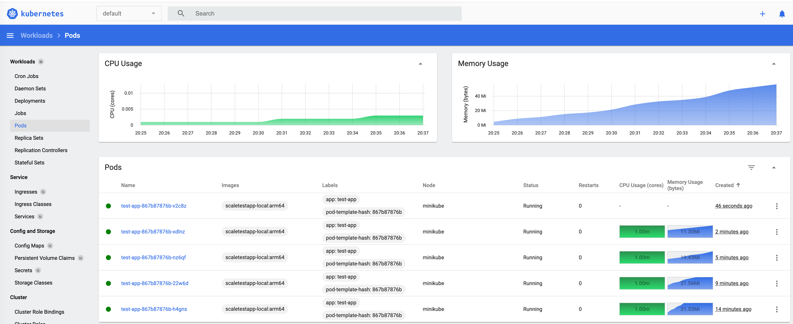
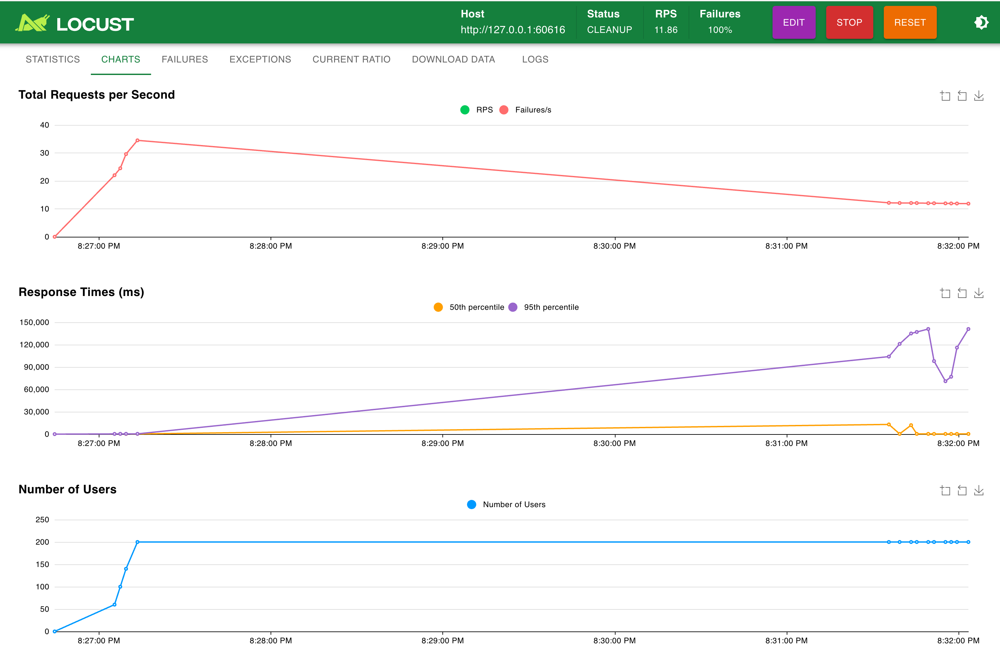
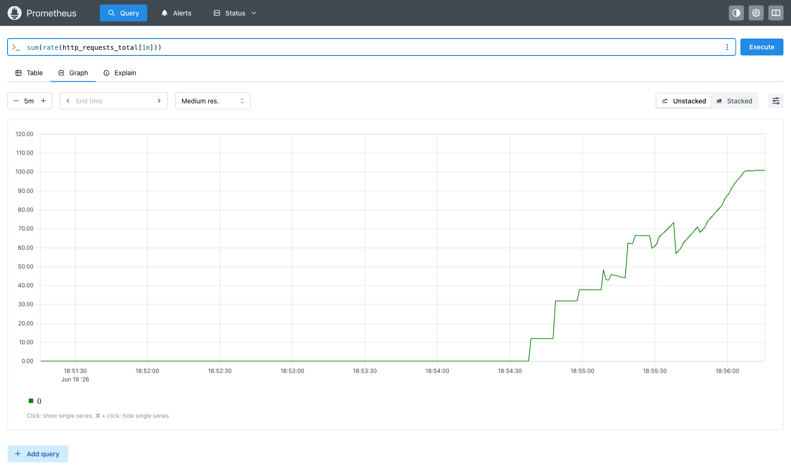
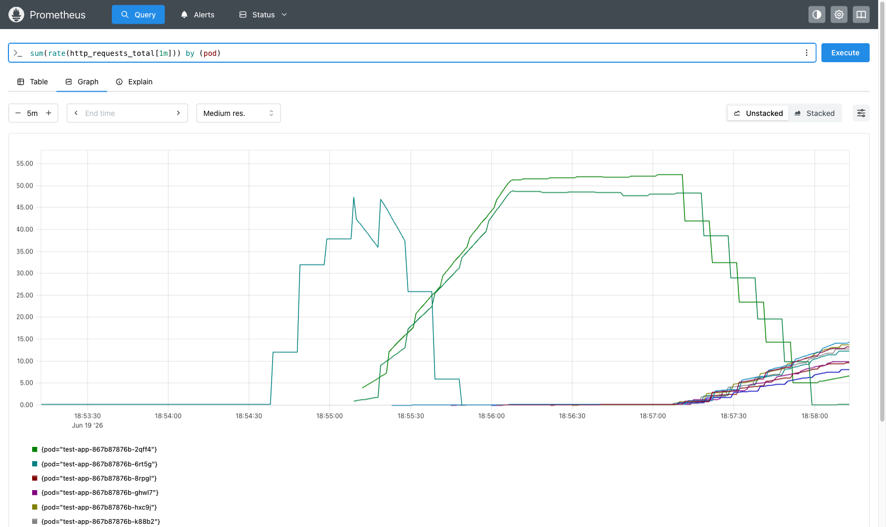

# Задание 2. Динамическое масштабирование контейнеров (HPA)

Тестовое приложение: `ghcr.io/yandex-practicum/scaletestapp:latest`
(`GET /` → идентификатор пода, `GET /metrics` → метрики Prometheus, порт `8080`, счётчик `http_requests_total`).

## Состав каталога

| Файл | Назначение |
|---|---|
| `deployment.yaml` | Deployment приложения: 1 реплика, `limits.memory: 30Mi` |
| `service.yaml` | Service типа `NodePort` |
| `hpa-memory.yaml` | **Часть 1** — HPA по памяти (80% утилизации, max 10) |
| `locustfile.py` | сценарий нагрузки Locust |
| `monitoring/servicemonitor.yaml` | **Часть 2** — scrape `/metrics` оператором Prometheus |
| `monitoring/prometheus-adapter-values.yaml` | **Часть 2** — публикация метрики `http_requests_per_second` в Custom Metrics API |
| `hpa-rps.yaml` | **Часть 2** — HPA по RPS на под (цель 10 RPS, max 10) |
| `screenshots/` | скриншоты/логи результатов |

## Предварительные требования

```bash
minikube start --driver=docker --cpus=2 --memory=3900
pip install locust            # для нагрузочного теста
```

### Образ приложения

`deployment.yaml` по умолчанию ссылается на **локальный arm64-образ** (`scaletestapp-local:arm64`),
т.к. официальный `ghcr.io/yandex-practicum/scaletestapp` собран только под `linux/amd64`
и не запускается на Apple Silicon.

- **Apple Silicon (arm64)** — соберите аналог в ноде:
  ```bash
  eval $(minikube docker-env)
  docker build -t scaletestapp-local:arm64 local-verify-arm64/
  ```
- **amd64 (Intel / Linux / CI)** — в `deployment.yaml` раскомментируйте строку с
  `image: ghcr.io/yandex-practicum/scaletestapp:latest`, закомментируйте локальный образ
  и `imagePullPolicy: Never`.

---

## Часть 1. Масштабирование по утилизации памяти

```bash
# 1. Метрики ресурсов (CPU/memory)
minikube addons enable metrics-server

# 2. Приложение + сервис + HPA
kubectl apply -f deployment.yaml
kubectl apply -f service.yaml
kubectl apply -f hpa-memory.yaml

# 3. URL приложения
minikube service test-app --url      # напр. http://192.168.49.2:31234

# 4. Наблюдение за масштабированием (в отдельных терминалах)
kubectl get hpa test-app -w
kubectl get pods -l app=test-app -w
```

**Нагрузка (вариант с веб-интерфейсом):**
```bash
locust -f locustfile.py            # затем http://localhost:8089
# Host = URL из `minikube service test-app --url`, users ~200, spawn rate ~20
```

**Нагрузка (headless, для выгрузки логов):**
```bash
locust -f locustfile.py --headless -u 200 -r 20 -t 5m \
  --host "$(minikube service test-app --url)"
```

Дашборд Kubernetes: `minikube dashboard`.

> **Как считается утилизация.** HPA для памяти сравнивает `usage / request`.
> В `deployment.yaml` `requests.memory = 20Mi`, `limits.memory = 30Mi`, поэтому
> порог 80% ≈ 16Mi. `request < limit` оставляет запас: HPA добавляет реплики (до 10)
> при 80% от 20Mi, а OOM наступает только у лимита 30Mi.

### Результаты (Часть 1)

Под нагрузкой утилизация памяти пробила 80% → HPA отмасштабировал реплики **1 → 9** (без OOM).
Лог: [`screenshots/part1-memory-hpa.log`](screenshots/part1-memory-hpa.log).

Kubernetes Dashboard — рост памяти и числа подов `test-app`:



Нагрузка через Locust:



---

## Часть 2. Масштабирование по RPS (Prometheus + Custom Metrics)

```bash
# 1. Prometheus Operator (kube-prometheus-stack)
helm repo add prometheus-community https://prometheus-community.github.io/helm-charts
helm repo update
kubectl create namespace monitoring
helm install monitoring prometheus-community/kube-prometheus-stack -n monitoring

# 2. Экспорт метрик приложения в Prometheus
kubectl apply -f monitoring/servicemonitor.yaml

# 3. Проверка, что метрики поступают (Prometheus Web UI)
kubectl -n monitoring port-forward svc/monitoring-kube-prometheus-prometheus 9090
#   http://localhost:9090  ->  Status > Targets (цель test-app = UP)
#   Graph: http_requests_total           (скриншот -> screenshots/)

# 4. prometheus-adapter -> публикация http_requests_per_second в Custom Metrics API
helm install prometheus-adapter prometheus-community/prometheus-adapter \
  -n monitoring -f monitoring/prometheus-adapter-values.yaml

# 5. Проверка custom-метрики
kubectl get --raw \
  "/apis/custom.metrics.k8s.io/v1beta1/namespaces/default/pods/*/http_requests_per_second" | jq .

# 6. HPA по RPS
kubectl apply -f hpa-rps.yaml
kubectl get hpa test-app-rps -w
```

Нагрузка — тем же `locustfile.py`, как в Части 1. Под нагрузкой HPA `test-app-rps`
увеличивает число реплик, удерживая ~10 RPS на под.

> **Цель RPS** задаётся в `hpa-rps.yaml` (`averageValue: "10"`) и подбирается под приложение.
> Имя релиза `monitoring` фигурирует в `servicemonitor.yaml` (`labels.release`) и
> в `prometheus-adapter-values.yaml` (`prometheus.url`) — при другом имени релиза поправьте оба места.

### Результаты (Часть 2)

Locust даёт ~100 RPS → HPA по `http_requests_per_second` масштабирует **1 → 10** подов.
Логи: [`screenshots/part2-prometheus-metrics.log`](screenshots/part2-prometheus-metrics.log),
[`screenshots/part2-rps-hpa.log`](screenshots/part2-rps-hpa.log).

Реальный RPS в Prometheus — `sum(rate(http_requests_total[1m]))`, растёт до ~100
(это и есть RPS — наклон счётчика, а не сам `http_requests_total`):



RPS по подам — `sum(rate(http_requests_total[1m])) by (pod)`: нагрузка растекается по 10 подам (scale-out):



---

## Очистка

```bash
kubectl delete -f hpa-rps.yaml -f hpa-memory.yaml -f service.yaml -f deployment.yaml
helm -n monitoring uninstall prometheus-adapter monitoring
minikube delete
```
