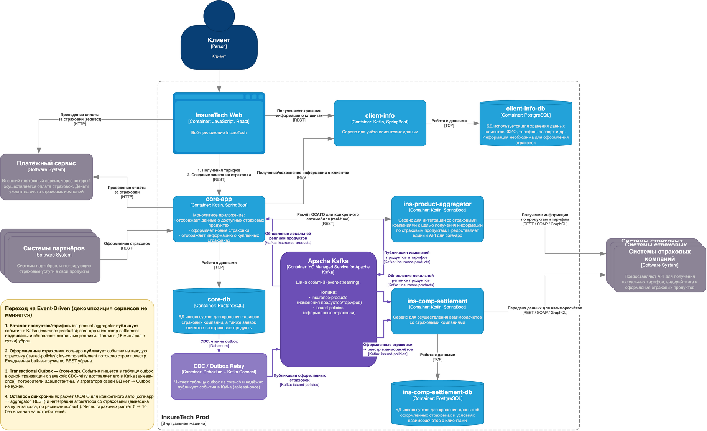

# Задание 3. Переход на Event-Driven: проблемы и риски текущей архитектуры

## Вывод

Текущие проблемы вызваны **синхронной связанностью** трёх типов взаимодействий:
1. `ins-product-aggregator` на каждый запрос синхронно опрашивает все страховые компании;
2. `core-app` и `ins-comp-settlement` **поллят** агрегатор за продуктами/тарифами;
3. `ins-comp-settlement` раз в сутки синхронно выгружает оформленные страховки из `core-app`.

При удвоении числа страховых компаний (5 → 10) эти связи деградируют нелинейно: растут латентность, частота сбоев и пиковая нагрузка. Решение — перевод распространения данных на **Event-Streaming (Apache Kafka)** и применение **Transactional Outbox** у издателей событий.

---

## Проблемы и риски (с учётом планируемого роста)

### 1. Синхронный fan-out и каскадные сбои
`ins-product-aggregator` агрегирует ответ в рамках того же синхронного запроса, опрашивая все страховые. Любая медленная/недоступная страховая → таймаут/ошибка всего запроса → ошибка распространяется на `core-app` и `ins-comp-settlement` (наблюдаемые «ошибки взаимодействия из-за задержек/ошибок API страховых»).

### 2. Падение доступности при росте числа интеграций
Доступность синхронной агрегации ≈ произведению доступностей всех страховых. При 10 интеграциях по 99% совокупная доступность ≈ 90%. Каждая новая страховая **снижает** надёжность.

### 3. Рост латентности (slowest-of-N)
Время ответа определяется самой медленной страховой. 10 интеграций вместо 5 увеличивают и вероятность, и величину задержки. Это напрямую бьёт по NPS/retention (медленная загрузка продуктов).

### 4. Поллинг: неэффективность, устаревание, дублирование
- `core-app` опрашивает агрегатор раз в 15 мин: данные устаревают до 15 минут; большинство опросов бесполезны (данные не менялись).
- Каждый опрос инициирует **полную повторную агрегацию** по всем страховым → нагрузка множится на число потребителей и частоту опроса.

### 5. Временная связанность (temporal coupling)
Потребитель обновляет реплику только в момент опроса. Если агрегатор/страховые недоступны именно тогда — обновление не происходит, ошибка всплывает у пользователя. Сервисы обязаны быть «живыми» одновременно.

### 6. Ежедневная bulk-выгрузка `ins-comp-settlement → core-app`
Синхронный массовый REST-запрос всех оформленных за сутки страховок: большой объём, риск таймаутов, ночной пик нагрузки. Недоступность `core-app` в этот момент срывает взаиморасчёты — прямой **финансовый риск** (задержка выплат агентских премий).

### 7. Жёсткая точечная (point-to-point) связанность
Каждый потребитель данных = отдельный REST-клиент с собственным расписанием опроса. Добавление нового потребителя/продукта требует новой интеграции и увеличивает нагрузку на источник.

### 8. Отсутствие буферизации, повторов и replay
Нет промежуточного буфера: транзиентная ошибка страховой сразу превращается в ошибку пользователю. Нельзя переиграть пропущенные изменения, нет backpressure при всплесках.

### 9. Согласованность локальных реплик
Реплики продуктов/тарифов в `core-app` и `ins-comp-settlement` обновляются опросом без гарантий доставки и порядка изменений → риск расхождения данных (например, оформление по устаревшему тарифу).

### 10. Масштабирование нагрузки
Подключение ещё 5 страховых ≈ удваивает исходящие вызовы агрегатора и число точек отказа. Рекламная кампания и рост числа продуктов умножают объём синхронных опросов.

---

## Влияние на бизнес
- **NPS / retention** — медленная и нестабильная выдача продуктов (п. 1–5).
- **SLA и финансы** — срыв ночных взаиморасчётов и каскадные сбои (п. 1, 6).
- **Скорость развития** — каждая новая страховая ухудшает надёжность вместо нейтрального подключения (п. 2, 7, 10).

---

## Предлагаемое решение (детально — на диаграмме `InsureTech_container-diagram_event-driven.drawio`)

Декомпозиция функциональности между сервисами **не меняется**. Меняется способ обмена данными.

*Фиолетовым выделены событийные связи (Apache Kafka), серым — оставшиеся синхронные (REST/TCP). Жёлтый блок — сводка решений.*

### Что переводим на Event-Streaming (Apache Kafka / Managed Service for Apache Kafka)
| Было (синхронно) | Стало (события) |
|---|---|
| `core-app` поллит агрегатор за продуктами/тарифами (15 мин) | `ins-product-aggregator` публикует события изменения продуктов/тарифов в топик `insurance-products`; `core-app` подписан и обновляет реплику |
| `ins-comp-settlement` поллит агрегатор за продуктами/тарифами (сутки) | `ins-comp-settlement` подписан на тот же топик `insurance-products` |
| `ins-comp-settlement` тянет оформленные страховки из `core-app` (сутки, bulk REST) | `core-app` публикует событие на каждую оформленную страховку в топик `issued-policies`; `ins-comp-settlement` накапливает их потоково |

**Эффекты:** разрыв временной связанности, near-real-time реплики, отсутствие дублирующей агрегации, исчезновение ночного пика, подключение новых потребителей без нагрузки на источник, буферизация и replay, изоляция сбоев страховых.

### Что осознанно остаётся синхронным
- **Расчёт ОСАГО для конкретного автомобиля** (`core-app → ins-product-aggregator`, REST): это запрос-ответ под конкретный автомобиль в реальном времени, его нельзя предрассчитать и раздать событиями.
- **Интеграция агрегатора со страховыми** (`ins-product-aggregator → страховые`, REST/SOAP/GraphQL): сохраняется, но **выносится из пути запроса клиента** — агрегатор опрашивает страховые по собственному расписанию/по push, ошибки и ретраи изолированы, в Kafka публикуется уже агрегированный результат.

### Решение по Transactional Outbox — ДА
Применяем **Transactional Outbox** у издателей, которые публикуют событие атомарно с локальной записью в БД, чтобы исключить проблему двойной записи (commit в БД есть, а событие не опубликовано, или наоборот):
- **`core-app` → `issued-policies` — обязательно.** Оформленная страховка и факт её публикации должны быть атомарны: потеря события искажает взаиморасчёты (деньги). Событие пишется в таблицу `outbox` в той же транзакции, что и заявка; relay (Debezium / Kafka Connect, CDC) надёжно доставляет его в Kafka (at-least-once).
- **`ins-product-aggregator` → `insurance-products` — не требуется** в текущем виде: агрегатор не хранит собственную БД (агрегирует данные страховых «на лету»), атомарной локальной записи нет → Outbox неприменим. Надёжность обеспечивается идемпотентными потребителями и периодической публикацией **полного снапшота** каталога. Если агрегатор начнёт персистить каталог в своей БД — Outbox станет уместен и там.

**Потребители — идемпотентны** (dedup по ключу события), т.к. доставка at-least-once.

---

## Компромиссы (trade-offs)
- **Eventual consistency:** реплики обновляются с задержкой доставки (обычно секунды) вместо «момента опроса». Для каталога продуктов допустимо; критичные операции оформления используют синхронный расчёт.
- **Операционная сложность:** появляется Kafka (брокер, топики, партиционирование, schema registry, мониторинг lag) и CDC-relay.
- **Контракты событий:** нужен Schema Registry и версионирование схем, иначе ломается совместимость потребителей.
- **Идемпотентность и порядок:** потребители обязаны дедуплицировать; ключ партиционирования (например, по `productId` / `policyId`) сохраняет порядок в рамках ключа.
